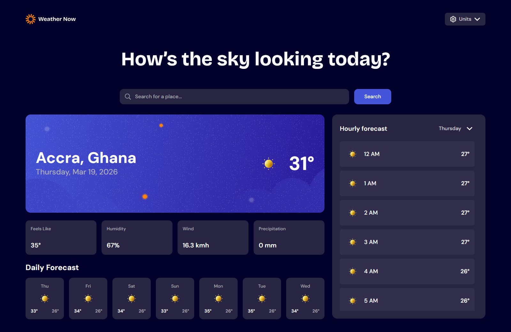

# Frontend Mentor - Testimonials grid section solution

This is a solution to the [Testimonials grid section challenge on Frontend Mentor](https://www.frontendmentor.io/challenges/testimonials-grid-section-Nnw6J7Un7). Frontend Mentor challenges help you improve your coding skills by building realistic projects. 

## Table of contents

- [Overview](#overview)
  - [The challenge](#the-challenge)
  - [Screenshot](#screenshot)
  - [Links](#links)
- [My process](#my-process)
  - [Built with](#built-with)
  - [What I learned](#what-i-learned)
- [Author](#author)

## Overview

### The challenge

Build a weather app using the [Open-Meteo API](https://open-meteo.com/) and get it looking as close to the design as possible.

You can use any tools you like to help you complete the challenge. So if you've got something you'd like to practice, feel free to give it a go.

Your users should be able to:

- Search for weather information by entering a location in the search bar
- View current weather conditions including temperature, weather icon, and location details
- See additional weather metrics like "feels like" temperature, humidity percentage, wind speed, and precipitation amounts
- Browse a 7-day weather forecast with daily high/low temperatures and weather icons
- View an hourly forecast showing temperature changes throughout the day
- Switch between different days of the week using the day selector in the hourly forecast section
- Toggle between Imperial and Metric measurement units via the units dropdown
- View the optimal layout for the interface depending on their device's screen size
- See hover and focus states for all interactive elements on the page

### Screenshot

### Links

- Solution URL: [Github](https://github.com/DavidAdjei/Weather_App_FrontendMentor/tree/main/weather-app)
- Live Site URL: [Vercel App](https://your-live-site-url.com)

## My process

### Built with

- Typescript
- React 
- Tailwind CSS
- Semantic HTML5 markup
- Flexbox
- CSS Grid

## Author

- Frontend Mentor - [@DavidAdjei](https://www.frontendmentor.io/profile/DavidAdjei)
- Twitter - [@nharnahadjei2](https://twitter.com/nharnahadjei2)
- LinkedIn - [@David Adjei](https://www.linkedin.com/in/david-adjei-313a811a2/)

